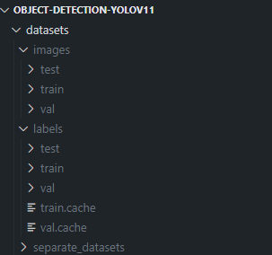

# object-detection-YOLOv11

This repository is for the YOLOv11-CV baseline test to, test its performance on object detection for parcels, doors, people, numbers and characters. 

## Setup and installations 

To install the repo locally, you will need [Poetry](https://python-poetry.org/). Once Poetry is installed, make sure your current directory is where the [pyproject.toml](pyproject.toml) file resides and run 
```
poetry shell
poetry install
```
This should create a virtual environment and install all the required dependancies in it. Note in order to export to tflite format python 12 is required with this setup.

## Preprocessing pipeline 

The preprocessing.ipynb combines a set of separate datasets that are already have YOLO format annotations with labels and images in one folder, located inside `datasets/separate_datasets`. Additionally, it splits them into 60-20-20 train-val-test splits and places them in appropriate labels & images folders as required for YOLOv11 training.



*Figure 1: Required data digestion folder structure for preprocessing*

## Training pipeline

The `training.ipynb` file runs the training for the YOLOv11 model. Then it exports it to `.onnx` format and `.tflite` format.

### Running from CLI

Trains the pretrained YOLOv11 nano for 100 epochs with 640px input image size. The data arg points to the custom dataset yaml for training. The device is automatically detected and selected - GPU if available.

Note, ensure you have the venv setup and activated see [setup and installations](#setup-and-installations).

```
yolo detect train data=model/data.yaml model=yolo11n.pt epochs=100 imgsz=640
```

You can also specify the device (and multiple devices).

```
# Start training from a pretrained *.pt model using GPUs 0 and 1
yolo detect train data=model/data.yaml model=yolo11n.pt epochs=100 imgsz=640 device=0,1
```